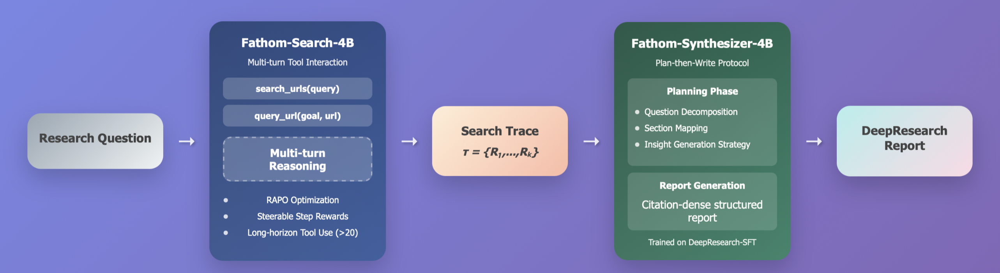
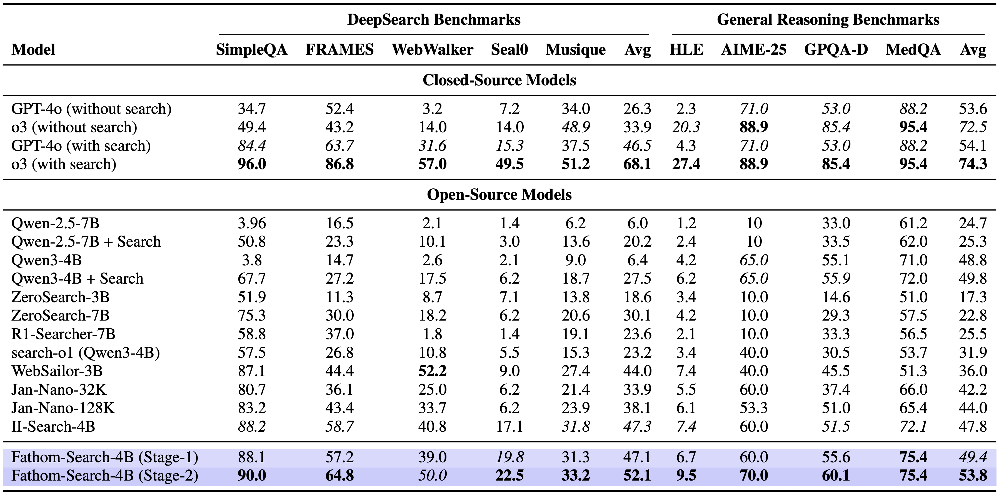
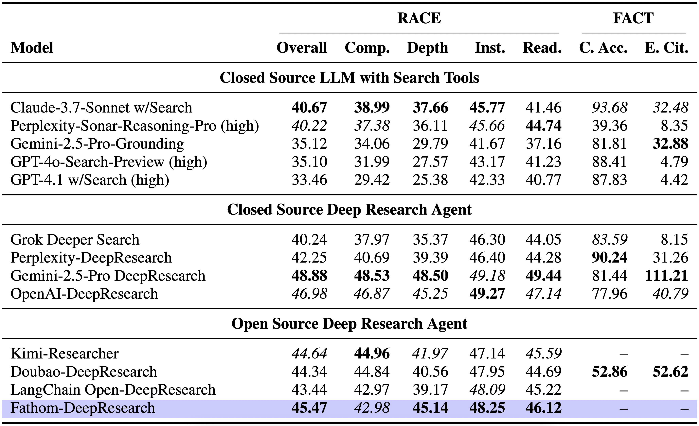

# 🧮 Fathom-DeepResearch: Unlocking Long Horizon Information Retrieval And Synthesis For SLMs

<div align="center">
  
[](https://huggingface.co/datasets/FractalAIResearch/DuetQA/)
[](https://huggingface.co/datasets/FractalAIResearch/DeepResearch-SFT/)
[](https://huggingface.co/spaces/FractalAIResearch/Fathom-Search-4B)
[](https://huggingface.co/FractalAIResearch/Fathom-Search-4B)
[](https://huggingface.co/FractalAIResearch/Fathom-Synthesizer-4B)

</div>


---
## Introduction

<p align="center">        </p>


## ✨ Key Innovations

- 🧭 **RL Zero framework for DeepSearch training.**  
  We present a novel two-stage RL-Zero framework that helps *steer cognitive behaviors*  developed by the policy model, such as exploration and verification during training.

- ⚡ **RAPO: Reward Aware Policy Optimization.**  
  We introduce a zero-overhead modification of GRPO with *dataset pruning , advantage scaling , replay buffers , and a steerable step-level reward that stabilizes multi-turn RL and enables long-horizon tool use .

## ✨ Key Contributions

- 🎭 **DuetQA.**  
  We release a ~5K-sample dataset created through our novel *multi-agent self-play pipeline*, containing verifiable question–answer pairs that are impossible to answer without *live web search* , for DeepSearch model training.

- 📝 **DeepResearch-SFT.**  
  A synthetic SFT corpus for converting downstream search/investigation traces of DeepSearch-enabled models into DeepResearch reports via an explicit *plan-then-write* protocol.

- 🏆 **Fathom-Search-4B** & **Fathom-Synthesizer-4B**
  SOTA 4B-parameter model trained to browse, extract, verify and reason over live web content acheiving  Deep search benchmarks. 
  and a 4B-parameter model to syntehize the Fathom-Search-4B search traces into rich citation-dense DeepResearch reports.


---

## 📊 Key Results

<p align="center">        </p>

<p align="center">        </p>


## 🚀 Inference

This section shows how to host the **tool web‑server** and the **SGLang model server**, then run **single‑question inference** via `inference.py`.

### 1) Environment setup

```bash
uv pip install torch==2.7.1 torchvision==0.22.1 torchaudio==2.7.1 --index-url https://download.pytorch.org/whl/cu126
uv pip install --no-build-isolation -r requirements.txt
playwright install-deps
playwright install
```

### 2) Start the Model Servers (SGLang)
Change `--model-path` to your model identifier or local path (e.g., `FractalAIResearch/Fathom-Search-4B` or `model_path`).
#### Fathom-Search-4B
Default port below for is **8902** 
```bash
export CUDA_VISIBLE_DEVICES=0,1
python -m sglang.launch_server \
  --served-model-name  Fathom-Search-4B \
  --model-path FractalAIResearch/Fathom-Search-4B \
  --enable-metrics \
  --dtype bfloat16 \
  --host 0.0.0.0 \
  --port 8902 \
  --trust-remote-code \
  --disable-radix-cache \
  --disable-cuda-graph \
  --context-length 40960 \
  --tp 2 #optional for multi-gpu inference
```
#### Fathom-Synthesizer-4B
Default port below for is **8903**, we use YARN scaling with RoPE factor 2.0 for the synthesizer model
```
export CUDA_VISIBLE_DEVICES=2,3
python3 -m sglang.launch_server \
         --served-model-name Fathom-Synthesizer-4B \
         --model-path FractalAIResearch/Fathom-Synthesizer-4B \
         --tp 2 \
         --enable-metrics \
         --dtype bfloat16 \
         --host 0.0.0.0 \
         --port 8903 \
         --trust-remote-code \
         --disable-radix-cache \
         --disable-cuda-graph \
         --disable-cuda-graph \
         --context-length 131092 \
         --json-model-override-args '{"rope_type":"yarn","factor":2.0,"original_max_position_embeddings":40960}'
```

### 3) Start the Tool Server (Serper+Jina)

Set the following in `scripts/.env`:

- **SERPER_API_KEY** (get from serper.dev; ~2,500 free queries without any card) (necessary for live web-search)
- **JINA_API_KEY** (optional) — used in the web-page extraction pipeline (recommended for replicaiion)
- **OPENAI_API_KEY** (optional) — for goal conditioned querying of web-pages using GPT-4.1-mini (recommended for replication)
- **SERPER_CACHE_DIR**  — path to caching the search results from serper.dev to save cost and retrival time 
- **JINA_CACHE_DIR**  — path to caching the search results from jina.ai to save cost and retrival time 

(Recommended) Launch on **port 8901** with 256 workers with the **gpt-4.1-mini** as the search backend for querying web-pages:
```bash
serving/host_serper.sh 8904 256 "openai:gpt-4.1-mini"
```
(Optionally) Launch search backend with a **locally hosted LLM of choice** at port XXXX and pass it as search backed (See step 2)
```bash
serving/host_serper.sh 8904 256 "http://0.0.0.0:XXXX"
```

### 4) Run DeepResearch! (Single question inference)

Run **Fathom‑DeeoSearch** via `inference.py`:

```bash
 python inference.py \
    --question "Find out the names of all the companies that have been selected under the IndiaAI mission? Write a detailed report on what their deliverables are? What are the ways in which this mission will impact india in the coming decade?" \
    --executors http://0.0.0.0:8904 \
    --model-url http://0.0.0.0:8902 \
    --tokenizer FractalAIResearch/Fathom-Search-4B \
    --summary-llm http://0.0.0.0:8903 \
    --deepresearch #DeepResearch mode!, disable to get Fathom-Search-4B response Faster & shorter
```

Tips:
- Use multiple executors for load‑balancing: `--executors http://0.0.0.0:8901, http://0.0.0.0:8903`.


---

## 🧮 Evaluation (Multi GPU)

This section covers **batched evaluation** using the provided scripts in `scripts/`. Use placeholders `model_path` and `dataset_name` — the evaluator will read `eval_benchmarks/<dataset_name>.jsonl` with columns `['id','question','answer']`.

### Common flags

| Flag | Required | Example | Description |
|---|:---:|---|---|
| `--model-path` | ✅ | `model_path` | Model repo ID or local path. |
| `--model-port` | ⬜ | `1255` | Port where the model server listens (if applicable). |
| `--executors` | ⬜ | `1211,1212` | Comma‑separated tool/extractor workers. |
| `--dataset` | ✅ | `dataset_name` | Looks for `eval_benchmarks/<dataset_name>.jsonl`. |
| `--out-base` | ⬜ | `./results` | Where results are written. |
| `--query-llm` | ⬜ | `gpt-4.1-mini` or `/path/to/Qwen3-4B` | Extractor/Query LLM. |
| `--query-port` | ⬜ | `1260` | Port for a locally served query LLM. |
| `--main-gpus` | ⬜ | `0,1` | CUDA devices for the main model. |
| `--query-gpus` | ⬜ | `2,3` | CUDA devices for the query LLM. |

### Evaluate Fathom‑Search

**GPT-4.1-mini query-LLM on CPU, main model on GPUs 0,1 (TP=2)**

```bash
scripts/eval_fathom_search.sh \
  --model-path model_path \
  --model-port 1255 \
  --executors 1211,1212 \
  --dataset dataset_name \
  --main-gpus 0,1 \
  --query-llm gpt-4.1-mini
```

**Local Qwen3-4B as extractor on GPUs 2,3 (TP=2); main model on GPUs 0,1 (TP=2)**

```bash
scripts/eval_fathom_search.sh \
  --model-path model_path \
  --model-port 1255 \
  --executors 1211,1212 \
  --dataset dataset_name \
  --main-gpus 0,1 \
  --query-llm /path/to/Qwen3-4B \
  --query-port 1260 \
  --query-gpus 2,3
```

### Evaluate other baselines used in the paper 

```bash
# II‑Search‑4B
scripts/eval_ii_search.sh \
  --model-path model_path \
  --model-port 1255 \
  --executors 1211,1212 \
  --dataset dataset_name

# Jan‑Nano‑32K
scripts/eval_jan_nano_32K.sh \
  --model-path model_path \
  --model-port 1255 \
  --executors 1211,1212 \
  --dataset dataset_name

# Jan‑Nano‑128K
scripts/eval_jan_nano_128K.sh \
  --model-path model_path \
  --model-port 1255 \
  --executors 1211,1212 \
  --dataset dataset_name

# R1‑Searcher (7B)
scripts/eval_r1_searcher.sh \
  --model-path model_path \
  --model-port 1255 \
  --dataset dataset_name

# ZeroSearch
scripts/eval_zerosearch.sh \
  --model-path model_path \
  --model-port 1255 \
  --dataset dataset_name

# search‑o1 (with Qwen3‑4B)
scripts/eval_search_o1.sh \
  --model-path model_path \
  --model-port 1255 \
  --dataset dataset_name

#cleanup ports after eval 
 scripts/cleanup.sh 1255 1211 1212
```

Run 

---

## 📜 License

This repository and all the release assets are available under the MIT License, underscoring our dedication to open and inclusive AI innovation. By freely sharing our work, we aim to democratize AI technology, empowering researchers, developers, and enthusiasts everywhere to use, adapt, and expand upon it without limitation. This open and permissive approach promotes global collaboration, accelerates innovation, and enriches the AI community as a whole.

## Acknowledgments
We would like to acknowledge the following works for enabling our project:
- [Qwen3-4B](https://huggingface.co/Qwen/Qwen-4B)
- [ReCall](https://github.com/Agent-RL/ReCall/tree/main)

---

## 📖 Citation

```bibtex
@misc{fathomsearch2025,
  title={Fathom-Search: Unlocking Long-Horizon DeepSearch},
  author={Shreyas Singh and Pradeep Moturi and Kunal Singh},
  howpublished={\url{https://huggingface.co/FractalAIResearch/Fathom-Search-4B}},
  note={Hugging Face},
  year={2025}
}
```

---

## About Project Ramanujan

Fractal AI Research Lab initiated Project Ramanujan approximately one year ago, aiming to unlock intelligence and enhance AI agents by pushing the boundaries of advanced reasoning. Our key accomplishments include:
- ICLR'25 & NeurIPS'24-MATH-AI: [SBSC: Step-By-Step Coding for Improving Mathematical Olympiad Performance](https://arxiv.org/abs/2502.16666)
- Winners of HackerCupAI@NeurIPS'24 & ICLR'25-VerifAI: [Stress Testing Based Self-Consistency For Olympiad Programming](https://openreview.net/forum?id=7SlCSjhBsq)
- CVPR'25-MULA: [TRISHUL: Towards Region Identification and Screen Hierarchy Understanding for Large VLM based GUI Agents
](https://arxiv.org/abs/2502.08226))
- Silver Medal in AIMO'24

